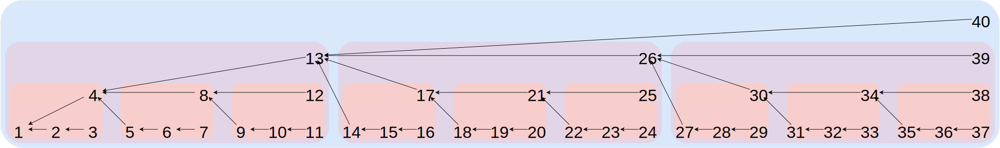

# Bamboo 🎍

A cryptographically secure, distributed, single-writer append-only log that supports transitive partial replication and local deletion of data.

Powered by [science](https://pdfs.semanticscholar.org/76cc/ae87b47d7f11a4c2ae76510dde205a635cd0.pdf), this log format can serve as a more efficient alternative to [secure-scuttlebutt](https://www.scuttlebutt.nz/)'s linked lists or [hypercore](https://github.com/mafintosh/hypercore)'s merkle forests.

**Status: Stable 🐼**

Better documentation in progress.

## Concepts and Properties

Each append-only _log_ is identified by a public key of a cryptographic signature scheme, and a 64 bit integer (one keypair can thus be used to maintain up to 2^64 logs). Conceptually, an _entry_ in the log is a tuple of:

-   the _author_ of the entry, a public key of the digital signature scheme that is used for the log
- the _log id_, a 64 bit integer
-   the _sequence number_ of the entry (i.e. the offset in the log)
-   the _backlink_, a cryptographically secure hash of the previous entry in the log
-   the _lipmaalink_, a cryptographically secure hash of some older entry in the log, chosen such that there are short paths between any pair of entries
-   the hash of the actual _payload_ of the entry
-   the _size_ of the payload in bytes
-   a boolean that indicates whether this is a regular entry or an _end-of-log_ marker
-   the digital signature of all the previous data, issued with the log's public key

Since all entries are signed, only the holder of the log's private key (the _author_) can create new entries. Thus logs can be replicated via potentially untrusted peers - any attempt to alter data or create new entries can be detected. The author however could _fork_ a log by giving different entries of the same sequence number to different peers, resulting in a directed tree rather than a log (aka a path in graph-theory parlance). This is where the backlinks come in: By iteratively traversing backlinks, any reader of the log can verify that no fork occured. Forked logs are considered invalid from the point of the earliest fork, so there is no incentive for the author to deliberately fork their log. Additionally, backlinks establish a causal order on the existence of entries: Each entry guarantees that all previous entries have already existed prior in time, else their hash could not have been (transitively) included.

As a result of these properties, replication of a full log between two peers becomes very simple: The peers compare the newest sequence numbers they are aware of, and the peer with newer entries sends them and the corresponding payloads to the other peer. The receiver verifies the integrity by checking author, signature, sequence numbers, payload sizes, backlink and lipmaalink, and then stores the entries in their local copy of the log. In this mode of replication, all peers are equally capable, it does not matter where the data originated. The worst a malicious peer could do is to deliberately withhold a suffix of the log.

This simple replication of full logs is inspired by [secure scuttlebutt](https://www.scuttlebutt.nz/) (ssb), and it only requires each entry to include a backlink to the previous entry. The core distinction between ssb and bamboo lies in the ability to partially replicate logs. By including the additional lipmaalink, bamboo gains two crucial properties: First, the shortest path between two entries has length logarithmic in the absolute difference of their sequence numbers. So to verify the created-before relation between two entries, only a small number of additional entries is needed.

While this property alone allows a peer to efficiently validate parts of a log, it does not automatically lead to transitive replication. Suppose a peer only has two entries `x` and `y`, as well as all entries needed to show that there is a path of links from `y` to `x` (we call those entries a _certificate for `x` and `y`_). Now if another peer has entry `z` and wants to get entry `y`, the first peer may not have the entries necessary to show that there's a path of backlinks from `z` to `y`, and thus they might not be able to replicate, even though entry `y` itself is available. Bamboo solves this problem by assigning a (logarithmically sized) set of entries `cert_pool(x)` (the _certificate pool of `x`_) to each entry `x`, such that for all entries `x` and `y` the union of `cert_pool(x)` and `cert_pool(y)` contains a path of links from `y` to `x` (or the other way around). This allows fully transitive partial replication where peers only need to store logarithmically more entries than they are directly interested in.

## Encoding

Since signatures and hashes are computed over concrete bytes rather than abstract descriptions, bamboo defines a precise binary encoding for the log entries. It uses multiformats so that new cryptographic primitives can be introduced without having to change the specification. The encoding is defined as the concatenation of the following byte strings:

-   `tag`, either a zero byte (`0x00`) to indicate a regular log entry, or a one byte (`0x01`) to indicate an end-of-log marker. No other values are valid. This can serve as an extension point: Future protocols that should be compatible with bamboo can use different tag values to introduce new functionality, for example signing primitives other than [ed25519](https://ed25519.cr.yp.to/).
-   `author`, the 32 bytes that make up the [ed25519](https://ed25519.cr.yp.to/) public key of the log's author
- `log_id`, the 64 bit integer that serves to distinguish different logs by the same author, encoded as a canonical [VarU64](https://github.com/AljoschaMeyer/varu64)
-   `seqnum`, the sequence number of the entry, encoded as a canonical [VarU64](https://github.com/AljoschaMeyer/varu64). Note that this limits the maximum size of logs to 2^64 - 1.
-   `lipmaalink`, the hash of an older log entry, encoded as a canonical, binary [yamf-hash](https://github.com/AljoschaMeyer/yamf-hash). For details on which entry the lipmaalink has to point to, see the next section. This is omitted if the `seqnum` is one, or if the seqnum is one more than the entry that would need to be hashed (including it would merely duplicate the `backlink` in this situation).
-   `backlink`, the hash of the previous log entry, encoded as a canonical, binary [yamf-hash](https://github.com/AljoschaMeyer/yamf-hash). This is omitted if the `seqnum` is one.
-   `size`, the size of the payload, encoded as a canonical [VarU64](https://github.com/AljoschaMeyer/varu64).
-   `payload_hash`, the hash of the payload, encoded as a canonical, binary [yamf-hash](https://github.com/AljoschaMeyer/yamf-hash).
-   `sig`, the signature obtained from signing the previous data with the author's private key (64 bytes)

Note that peers don't necessarily have to adhere to this encoding when persisting or exchanging data. In some cases, author, tag, seqnum, backlinks and payload_hash can be reconstructed without them having to be transmitted. This encoding is only binding for signature verification and hash computation, nothing more.

The authenticity of an entry can be verified by checking whether the signature is correct. Further validity checks on sequence numbers and backlinks are necessary to guarantee absence of forks and verify the claimed entry creation order, as described in the next section.

## Links and Entry Verification

The lipmaalinks are chosen such that for any pair of entries there is a path from the newer to the older one of a length logarithmic in their distance. Here is a graphical representation of the lipmaalinks in a log of 40 entries, the colored boxes indicating its recursive structure: 

The lipmaalink target of the entry of sequence number `n` is computed through the function `f`, defined below:


And a plaintext version of the same formula:

```yay,math!
f(n) := if (n == (((3^k) - 1) / 2) for some natural number k) then {
  return n - (3^(k-1));
} else {
  return n - (((3^g(n)) - 1) / 2);
}

g(n) := if (n == (((3^k) - 1) / 2) for some natural number k) then {
  return k;
} else {
  let k := the natural number k such that (((3^(k - 1)) - 1) / 2) < n < (((3^(k)) - 1) / 2);
  return g(n - (((3^(k - 1)) - 1) / 2));
}
```

Sorry for the math, but on the plus side, it works! This computes the edges according to the scheme presented in [Buldas, A., & Laud, P. (1998, December). New linking schemes for digital time-stamping](https://pdfs.semanticscholar.org/76cc/ae87b47d7f11a4c2ae76510dde205a635cd0.pdf). For a (slightly) more enjoyable overview of the theory behind this, I'd recommend [Helger Lipmaa's thesis](https://kodu.ut.ee/~lipmaa/papers/thesis/thesis.pdf).

An alternate way of gaining some intuition about the lipmaalinks is to think of the sequence numbers in [ternary (base 3)](https://en.wikipedia.org/wiki/Ternary_numeral_system). In ternary, `3^k` is represented as a `1` digit followed by `k` zero digits. `(3^k) - 1` is thus `k` `2` digits, and `((3^k) - 1) / 2` is `k` `1` digits. So if the sequence number consists solely of `1` digits in ternary, we enter the first branch of the formulas and `k` is the number of digits. Otherwise (i.e. if the sequence number is _not_ half of the predecessor of a power of three), `k` is the number of ternary digits of the next smaller number whose ternary representation consists solely of `1` digits.

A python function computing lipmaalinks that doesn't explicitly use logarithms (credit goes to [cft](https://cn.dmi.unibas.ch/people/cft/)):

```python
def lipmaa_iterative(n):
    m, po3, x = 1, 3, n
    # find k such that (3^k - 1)/2 >= n
    while m < n:
        po3 *= 3
        m = (po3 - 1) // 2
    po3 //= 3
    # find longest possible backjump
    if m != n:
        while x != 0:
            m = (po3 - 1) // 2
            po3 //= 3
            x %= m
        if m != po3:
            po3 = m
    return n - po3
```

Whether the created-before relation claimed by the sequence numbers `x` and `y` of two entries is indeed valid can be verified by finding a path along the links from the (claimed) newer entry to the older one. By verifying the created-before relation over all known entries of a log, a peer can check that the entries form indeed a single log (rather than disparate logs, trees or dags).

An entry is considered _verified_ if and only if:

-   authenticity has been checked via the signature (matching the claimed author)
-   the entry has sequence number one OR there is a link path from the entry to the first entry, where all but the newest entry (which is the one to be verified) are already verified
-   the entry has sequence number one OR the backlink and the lipmaalink point to the entry of the expected sequence number

Additionally, if the payload of an entry is available to a peer, the peer must check wether it hashes to the claimed (and signed) hash, and whether the size of the payload in bytes matches the claimed (and signed) size metadata. If it doesn't, the feed must be considered invalid from that entry onwards (there's zero tolerance for authors lying about payload sizes).

## Partial Replication and Log Verification

When partially replicating a log, a peer is only interested in a subset of the log's entries. Verifying all elements of a subset of a log independently does not yet verify the subset as a whole. For a subset to be considered verified, there must also be a backlink path from the newest entry to the first entry that contains all other entries of the subset. Otherwise, the created-before relation claimed by the entry's sequence numbers isn't verified.

To traverse that path, the peer may have to store other entries it isn't really interested in. It doesn't need to fully verify those, but it should still check authenticity and follow backlinks if their target is available, to check for forks and invalid sequence numbers. In particular, there is no need to request the payload of these entries.

For some entry `x` the peer is interested in, the _certificate pool of `x`_ is the (logarithmically sized) set of further entries the peer needs to store. It is defined as the union of the shortest link paths from:

-   `x` to `1`
-   `z` to `x`, where `z` is the smallest natural number greater than or equal to `x` such that there exists a natural number `k` with `z == (((3^k) - 1) / 2)`

The following graphic shows the certificate pool for entry 23. The path from 23 to 1 is marked in blue, the path from 40 to 23 in orange. Note that even if the log becomes larger than 40 messages, the certificate pool does not grow.


Note that this is a superset of the entries needed to verify `x` agains the first entry. The path from `z` to `x` is needed so that the union of two certificate pools for two entries `x` and `y` (`x` < `y`) always contains a path from `y` to `1` via `x`. By requesting full certificate pools from its peers, a peer can then always verify the full log subset it is interested in.

Note also that the entries of the path from `z` to `x` do not necessarily exist yet. The log subset can still be fully verified, since the non-existent entries are only needed to allow later extensions of the subset (at which point the new entries do exist). Finally note that peers can efficiently request full certificate pools by just specifying the single sequence number they are interested in. They can also tell their peers about subsets of the certificate pool they already have in the same way, resulting in very low communication overhead.

## Related Work

[Secure scuttlebutt](https://www.scuttlebutt.nz/) inspired bamboo. Bamboo can be seen as a generalization of ssb's signed linked lists to a binary anti-monotone graph to allow partial replication. To mitigate the lack of partial replication, ssb supports retrieval of log entries via hash, but forfeits the security guarantees of regularly replicated entries. As of writing, ssb also signs the payloads directly rather than their hash, making it impossible to locally delete log payloads without losing the ability to replicate the log to other peers. The ssb folks are currently working on making bamboo or a very similar format part of ssb.

[Hypercore](https://github.com/mafintosh/hypercore) is a distributed, sparsely-replicatable append-only log like bamboo. It uses merkle trees whereas bamboo only uses backlinks. Hypercore has slightly smaller certificates for partial verification (but still in `O(log(n))`), but appending or verifying an entry has a worst-case time complexity of `O(log(n))` rather than bamboo's `O(1)`. See [here](https://github.com/AljoschaMeyer/bamboo/issues/2) for a brief discussion of hypercore and its more complex verification mechanism. Transitive sparse replication via certificate pools can also be implemented on top of hypercore.

[Leyline-core](https://github.com/AljoschaMeyer/leyline-core) is the author's clumsy first attempt at defining a log structure that supports partial replication. It ends up badly reinventing [authenticated append-only skip lists](https://arxiv.org/pdf/cs/0302010.pdf), which are arguably inferior to the [anti-monotone scheme](https://kodu.ut.ee/~lipmaa/papers/thesis/thesis.pdf) that bamboo uses.

## Implementations

This is a list of of bamboo implementations, submitted by their programmers. Please send a pull request if you want yours added as well. 

[bamboo-rs](https://github.com/pietgeursen/bamboo-rs). Builds for 28+ targets including Linux, Windows, Mac, bare-metal embedded, and WASM.
